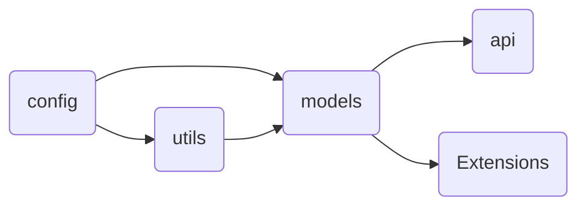

# Übersicht der Module

###### Aktualisiert mit 2.0.0

```
├── api                         # Klassen zum Abrufen von Vertretungspläne
├── config                      # Modul zum Konfigurieren von Parsing-Verhalten
├── models                      # Klassen zur typisierten Repräsentation von Plänen und Planinhalten
├── utils                       # Hilfsfunktionen für Parsing
└── extensions                  # Module für erweiterte Funktionen
    ├── einzpläne               # Funktionen zum auswerten von EinzPläne-PDFs
    └── reparser                # Funktionen zum ändern der Perspektive eines Vertretungsplans
```

